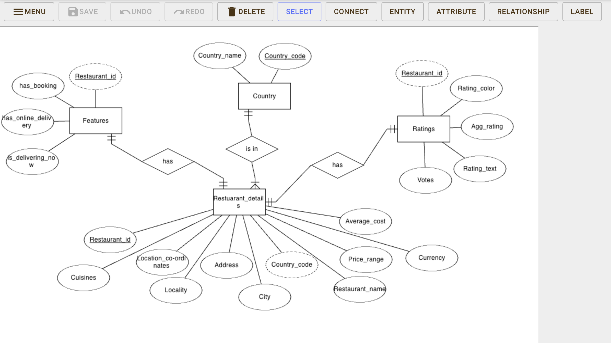
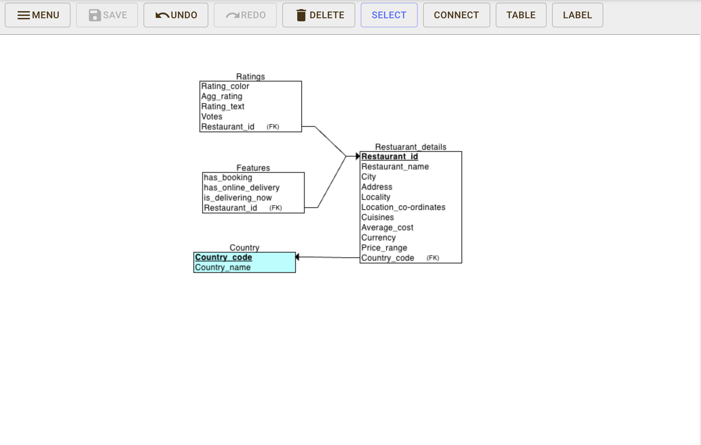

# Zomato-restaurants-Data-Analysis

Data collection: - 

The dataset Zomato restaurants have been fetched from the following link on Kaggle.  
Dataset: - https://www.kaggle.com/datasets/shrutimehta/zomato-restaurants-data

This dataset contains the following columns: -
- Restaurant Name: Name of the restaurant
- Country Code: Country in which the restaurant is located
- City: City in which the restaurant is located
- Address: Address of the restaurant
- Locality: Location in the city
- Locality Verbose: Detailed description of the locality
- Longitude: Longitude coordinate of the restaurant's location
- Latitude: Latitude coordinate of the restaurant's location
- Cuisines: Cuisines offered by the restaurant
- Average Cost for two: Cost for two people in different currencies.
- Currency: Currency of the country
- Has Table booking:  yes/no
- Has Online delivery: yes/ no
- Is delivering: yes/ no
- Switch to order menu: yes/no
- Price range: range of price of food
- Aggregate Rating: Average rating out of 5
- Rating color: Depending upon the average rating color
- Rating text: Text on the basis of rating rating
- Votes: Number of ratings cast by people

Importing the data into the database: -
- Created a new database named Zomato on MySQL server.
- Created a new connection with MySQL server on dbeaver to access the Zomato database.
- After connecting with the server, a new table named Restaurant_details was created to store a few attributes of the dataset.
- Zomato restaurants data (.csv file) was imported through the “Import Option” available by clicking on the table Restaurant_details. 
- The attributes from the zomato dataset are further split into the tables:
  - restaurants_details
  - features
  - ratings
  - country_codes,
  the data is imported into each from the zomato.csv file using the Import option in dbeaver.
- While processing the data transfer from the .csv file into the tables, the columns have been configured as follows:

|      Column Name     |   Data Type  |
|:--------------------:|:------------:|
| Restaurant ID        | int          |
| Restaurant Name      | varchar(100) |
| Country Code         | int          |
| City                 | varchar(200) |
| Address              | varchar(200) |
| Locality             | varchar(64)  |
| Locality Verbose     | varchar(64)  |
| Longitude            | double       |
| Latitude             | double       |
| Cuisines             | varchar(200) |
| Average Cost for two | int          |
| Currency             | varchar(200) |
| Has Table booking    | varchar(50)  |
| Has Online delivery  | varchar(50)  |
| IS delivering now    | varchar(50)  |
| Switch to order menu | varchar(50)  |
| Price range          | int          |
| Aggregate rating     | double       |
| Rating Color         | varchar(50)  |
| Rating text          | varchar(50)  |
| Votes                | int          |

-The relation among tables is demonstrated by the below E-R model:

|  |  |
|:-------------:|:------------:|
